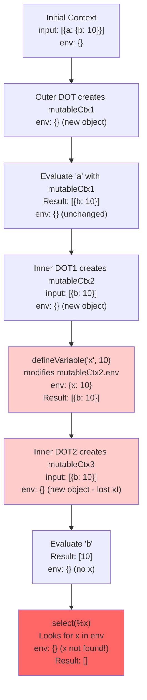
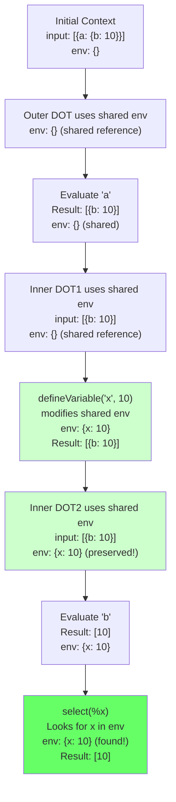

# Context Flow Visualization: defineVariable and the Dot Operator

## Test Case: `a.defineVariable('x', 10).b.select(%x)`

Input: `[{a: {b: 10}}]`

### AST Structure
```
DOT
├── left: a
└── right: DOT
    ├── left: defineVariable('x', 10)
    └── right: DOT
        ├── left: b
        └── right: select(%x)
```

### Execution Flow - Before Fix (❌ Failed)



**Problem**: Each DOT operator created a new `env` object, so the modification made by `defineVariable` was lost.

### Execution Flow - After Fix (✅ Passes)



**Solution**: All DOT operators share the same `env` object reference, allowing `defineVariable` modifications to persist.

## Key Concepts

### 1. Context Structure
```typescript
interface RuntimeContext {
  input: any[];      // Current data being processed
  focus: any[];      // Same as input (for $this)
  env: {            // Variable environment
    [key: string]: any;
    $this?: any;
    $index?: number;
    $total?: number;
  }
}
```

### 2. How defineVariable Works
```typescript
// defineVariable('x', 10) does:
ctx.env['x'] = 10;        // Modifies env in-place
return input;             // Passes input through unchanged
```

### 3. How DOT Operator Works
```typescript
// Before fix - Created new env:
const mutableCtx = {
  ...ctx,
  env: { ...ctx.env }  // NEW object - loses modifications!
};

// After fix - Shares env:
const mutableCtx = {
  ...ctx               // env is shared from parent context
};
```

## Other Test Cases

### Test 2: `defineVariable('x', 10).a.b.select(%x)`
```
Initial: env: {}
After defineVariable: env: {x: 10}
After .a: env: {x: 10} (preserved)
After .b: env: {x: 10} (preserved)
After select(%x): Returns [10]
```

### Test 3: Chained defineVariable
```
defineVariable('x', 5).defineVariable('y', %x + 5).select(%y)

env: {} → {x: 5} → {x: 5, y: 10} → Returns [10]
```

## Visual Summary

The fix ensures that the `env` object is shared across all operations in a DOT chain, allowing variables defined at any point to be accessible later in the expression:

```
Expression: a.defineVariable('x', 10).b.select(%x)
            ↓         ↓                ↓     ↓
env:       {} ────→ {x:10} ────────→ {x:10} → {x:10}
                    (shared across entire chain)
```

This matches the interpreter's behavior where context modifications flow through the entire expression chain.